# multipass_install

## 概要

multipass を Windows にインストールする際の手順について記載しています。

[multipass](https://multipass.run/) とは  
Canonical が開発している、Windows / macOS / Linux で使える仮想マシン管理ツールです。

## 目次
* 前提
* インストール手順
* 動作確認
* FAQ

## 前提
* 2024/3/12 時点のものです。  
* multipass のバージョンは `1.13.1+win-win64` です。  
  ※バージョンは適宜読み替えてください。 
* インストール先は Windows 10 です。  
  ※ Windows 11 でも手順は同じだと思いますが未確認です。

## インストール手順

1. [multipass - install](https://multipass.run/install) にアクセス

1. Select OS to get started で `Windows` をクリック
   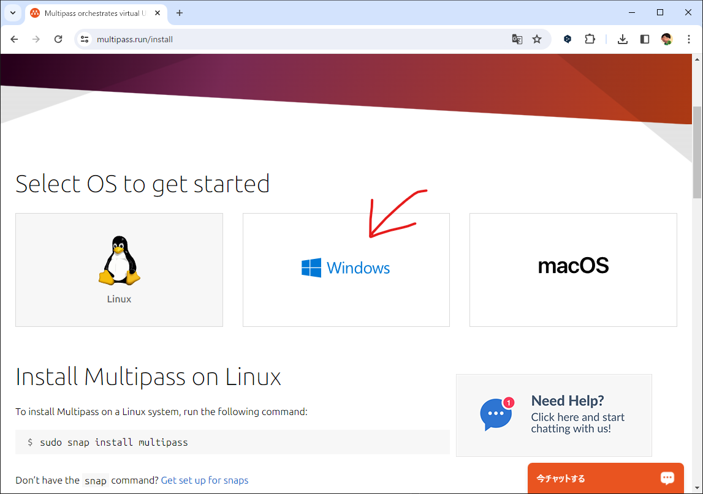

1. `Download Multipass for Windows` をクリック
   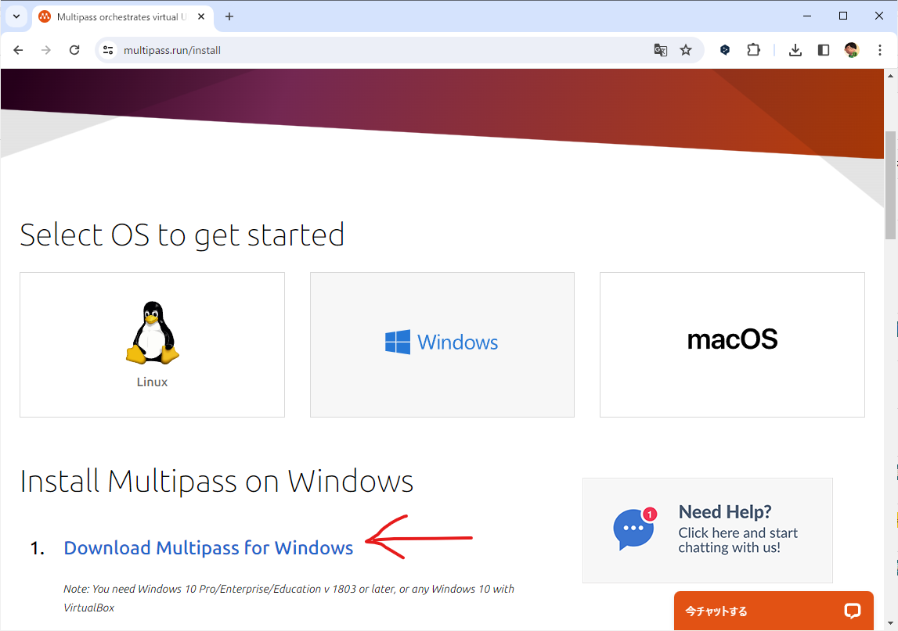

1. ダウンロードが完了したら `multipass-1.13.1+win-win64.exe` を実行  
   ※バージョンは適宜読み替えてください。
   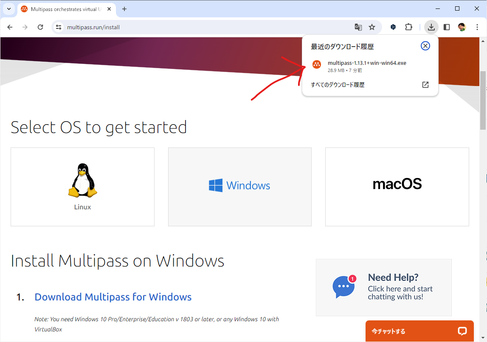

1. `次へ(N)>` をクリック 
   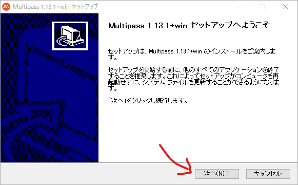

1. 契約を全て読み `同意する(A)` をクリック
   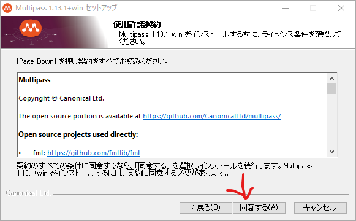

1. multipass で操作する仮想化ソフトを選択  
   ※後で変更可能
   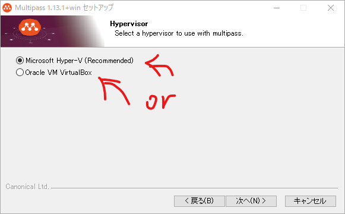

1. `次へ(N)>` をクリック  
   ※画像は `VirtualBox` を選択した場合
   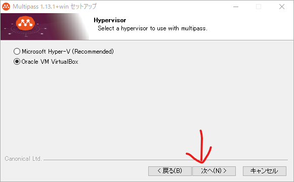

1. multipass へのパスを環境変数の PATH に追加するか聞かれるので、よくわからない人は画像の選択のまま変更しない。わかる人は好きなものを選択
   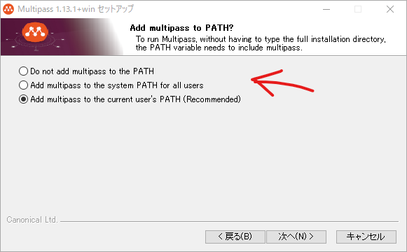

1. `次へ(N)>` をクリック  
   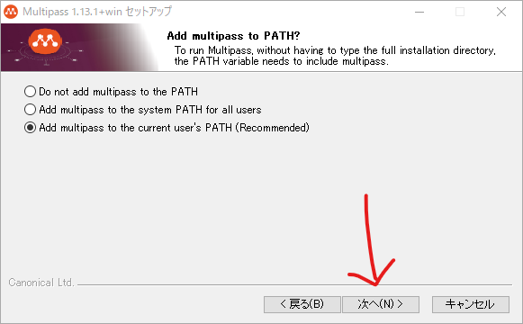

1. multipass のインストール先を聞かれるので、よくわからない人は画像の指定のまま変更しない。わかる人は好きな場所を指定 
   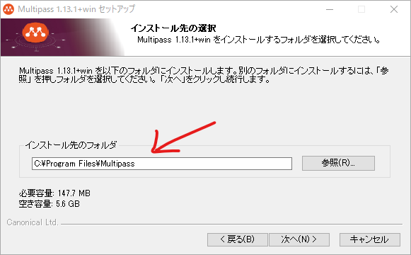

1. `次へ(N)>` をクリック  
   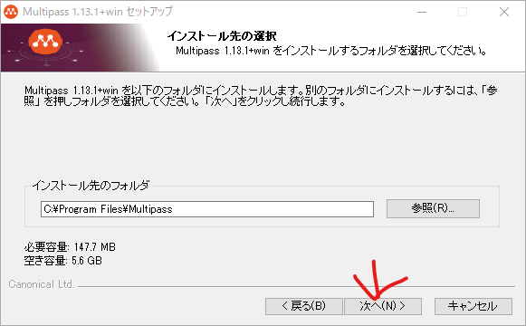

1. `インストール(I)` をクリック  
   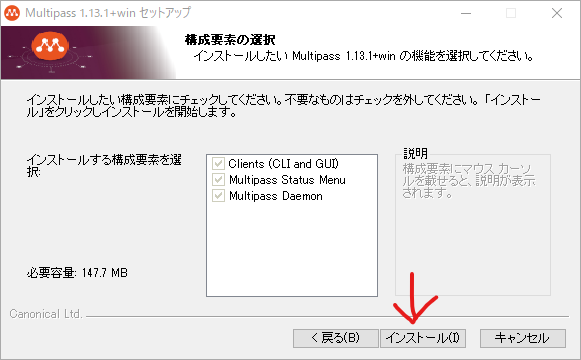

1. インストールの完了を待つ
   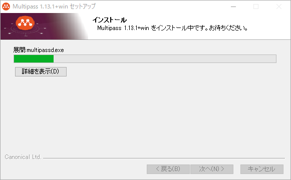

1. `完了(F)` をクリック
   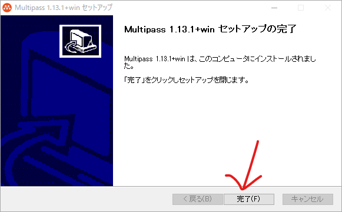

## 動作確認

1. 適当なコンソールを開き `multipass --version` を実行
1. 以下のようにバージョンが表示されれば OK
   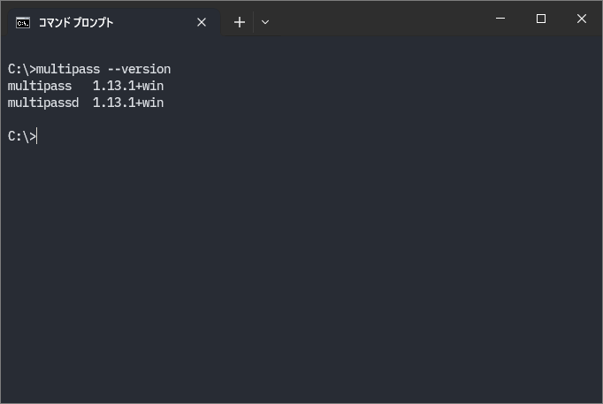

## FAQ

### インストール中に `Warning! PATH too long installer unable to modify PATH!` という警告メッセージが表示された  
   
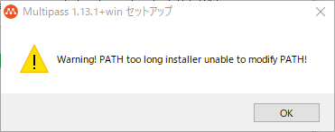  
※日本語訳: `警告！ PATH が長すぎてインストーラーが PATH を変更できません！`  
#### 原因

* メッセージの通り。環境変数の PATH に既に大量のパスが登録されているため、multipass のパスを登録できない状態になっている。  
※[PC​/Windows​/Windowsの環境変数のサイズやPATHの長さ制限について](https://yueno.net/xoops/modules/xpwiki/?PC%2FWindows%2FWindows%E3%81%AE%E7%92%B0%E5%A2%83%E5%A4%89%E6%95%B0%E3%81%AE%E3%82%B5%E3%82%A4%E3%82%BA%E3%82%84PATH%E3%81%AE%E9%95%B7%E3%81%95%E5%88%B6%E9%99%90%E3%81%AB%E3%81%A4%E3%81%84%E3%81%A6)

#### 対応  

1. 上記のメッセージは `OK` をクリックして、そのままインストールは完了させる
1. 以下の記事を参考に multipass をインストールしたフォルダ内にある bin フォルダへのパスを手動で PATH に追加する  
   ※例: `C:\Program Files\Multipass\bin`  
   [Windowsの環境変数に「Path」を追加する方法](https://engrholiday.jp/win/surface-env-path/)
1. 追加した multipass へのパスを `上へ(U)` をクリックして上へ移動する  
   ※ multipass へのパスを追加した分、下にあるパスが認識されなくなるので、他のパスの位置も必要に応じて調整すること  
   ( この警告に遭遇するほど PATH が長い人は、そもそも知識がある人だと思うので適当に自力で解決して )  
   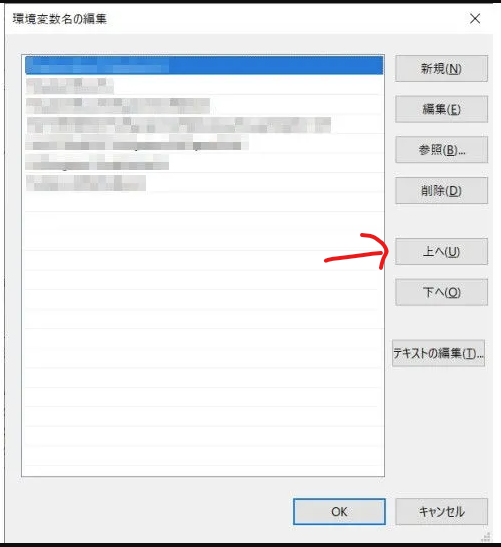
1. 本記事の `動作確認` の手順が実施できることを確認する  
   ※環境変数の変更はコンソールを再起動しないと反映されないことに注意